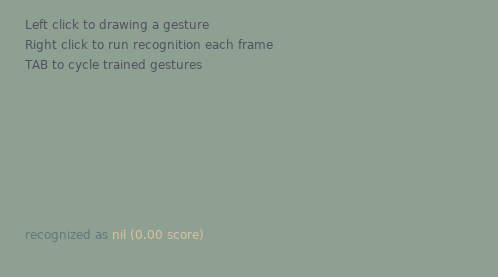

# lua-gestures



This library implements single-stroke gesture recognition in pure Lua code. It can reliably recognize letters, numbers, symbols and drawings based on just single training sample per gesture. It can be used for text entry method, as a way to trigger actions in design tools, or for casting spells in magic games.

The gesture is captured as list of coordinates. From this the library can determine which previously-trained gesture is the closest match. New gestures can be added on the fly. Often only a single recorded sample of gesture is enough to achieve reliable recognition.

The original algorithm is [$1 Unistroke Recognizer](http://depts.washington.edu/acelab/proj/dollar/index.html). The Lua port was written by [Lance Ulmer](https://github.com/lanceulmer/dollar.lua/). 

The lua-gestures project fixes the found bugs, provides some useful options, simplifies the API and provides demo applications for testing and managing custom gestures.

Gestures are limited to single-stroke patterns, so the recognizer cannot be used for conventional alphabet with letters such as "X" (two strokes). It is still possible to adapt letters to single-stroke variations and type with good accuracy. The huge benefit of single-stroke gesture is ease of detection of intended start and end of gesture. For example, as soon as mouse is released the gesture is considered done and it can be processed without waiting for confirmation.

The algorithm is sensitive to gesture drawing direction. If both drawing directions need to be supported, the same gesture can be reversed and added to recognizer second time under the same name.

## Basic usage

```lua
gestures = require('gestures')()

-- populate the recognizer with different gestures
gestures.add('gesture 1', list_of_points1)
gestures.add('gesture 2', list_of_points2)

-- app collects mouse/touch coordinates into list_of_points table

name = gestures.recognize(list_of_points)
-- name is now either 'gesture 1' or 'gesture 2'
```

## Recognizer configuration

Just like $1 original, this library includes 2 algorithms to match gesture against trained gestures. The original $1 algorithm used "Golden Section Search" to iteratively arrive at best angle between gesture and template. The "Protractor" algorithm is later improvement which uses closed form expression to arrive at angle that fits best. Because protractor variant is faster, it is used as default.

With added configuration option the recognizer can be rotationally sensitive. This means that '+' won't be recognized as 'x', which allows for more gestures to be distinguished with same accuracy. If user needs to be able to draw gesture in any orientation, either disable this option or register multiple identical gestures in different directions (depending on use case). Gestures are oriented (rotationally sensitive) by default.

Another added configuration option is uniform scaling. The original algorithm uses non-uniform scaling to better match complex gestures against templates. By limiting to uniform scaling, some thin gestures like '-' and '|' can be reliably recognized. Uniform scaling is therefore a default setting.

Take care when experimenting with options that trained templates might have to be re-created. For example, templates that were extracted from non-oriented non-uniform recognizer will not give good result when used with oriented uniform recognizer.


## API


### constructor

Requiring the lib returns the constructor function which has to be called to get the recognizer object.

```lua
oriented, uniform, protractor = true, true, true
recognizer_constructor = require('gestures')
recognizer = recognizer_constructor(oriented, uniform, protractor)
```

The `oriented`, `uniform` and `protractor` arguments are booleans that configure the recognizer (as explained above). If not supplied they all default to `true`.

If needed, several different recognizer objects can be constructed, each with its own set of gestures to compare against. This is useful to separate the gestures into smaller sets, and during runtime call each recognizer depending on UI context.

### add

`count = gestures.add(name, points)`

The recognizer starts with empty set of trained gestures. Function `add` trains the recognizer with new gesture.

`name` is (usually) a string.
`points` is either a flat list of coordinates `{x1, y1, x2, y2 ...}` or nested list of coordinates `{{x1, y1}, {x2, y2} ...}`.

Function returns number of gestures currently registered under the name. It is normal to add multiple gestures under same name as part of training.

### recognize

`name, score, index = gestures.recognize(points)`

To recognize user gesture, collect the points forming the gesture and pass them into the `recognize` function. 

`points` is either a flat list of coordinates `{x1, y1, x2, y2 ...}` or nested list of coordinates `{{x1, y1}, {x2, y2} ...}`.

Function returns `name` (string, or whatever was supplied) of closest match, `score` as numerical measure on how good the match is, and its `index` within list of trained gestures. Score 0 is worst, more is better.

### remove

`gestures.remove(name)`

This function removes all gestures registered with same `name` and returns the number of gestures removed. The defined gestures can be removed at any time.

### serialize

The list of trained gestures can be extracted from the recognizer.

`serialized = gestures.serialize(name)`

If `name` string is given, only gestures with same name will be serialized, otherwise all defined gestures will be returned.

Function returns `serialized` string. It is formatted as multiline Lua code block.

## Demo app

The included [LÖVE](https://love2d.org/) demo app can be used to evaluate the algorithm, learn its strengths and weaknesses, and as reference on how to incorporate it into UI framework.

The app is also useful for quickly defining custom gestures and extracting them to be used in other projects.

To run the app, download LÖVE interpreter and execute it with `love-demo` directory as parameter.

## License

The library is licensed under "New BSD License". Original license and Lua port license are included in source files.
